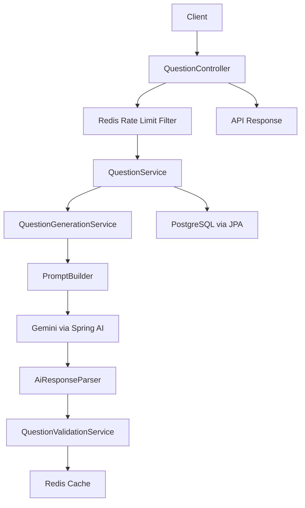

# AI Interview Question Generator (Spring Boot Backend)

## Overview
This project is a production-oriented Spring Boot backend for interview question generation. It uses Gemini for generation, then applies parsing/validation, persistence, caching, and request controls so the API is reliable under repeated and high-frequency usage.

## What This Service Adds Beyond a Basic AI Wrapper
- Contracted API behavior with input validation and consistent response shapes
- Structured parsing of model output into application-safe data
- Persistence and retrieval workflows (pagination/filtering/sorting) over PostgreSQL
- Duplicate prevention at both application and database levels
- Rating workflow with aggregate update logic
- Redis-backed caching for repeated generation requests
- Redis-backed rate limiting to protect model and API usage
- Operational endpoints (`/actuator/health`) and OpenAPI docs for integration

## Features
- AI-based question generation by `topic`, `difficulty`, and `questionCount`
- Structured JSON parsing and validation pipeline
- PostgreSQL persistence with duplicate-row prevention
- Retrieval API with pagination, filtering, and sorting
- Rating API with running-average calculation
- Redis caching for repeated generation requests
- Redis-based IP rate limiting for generation endpoint
- OpenAPI/Swagger UI support
- Health endpoint for deployment checks

## Architecture Flow


## Tech Stack
- Java 17
- Spring Boot 3.5
- Spring AI (Gemini)
- LangChain4j (structured AI ecosystem support)
- PostgreSQL
- Redis / Valkey-compatible Key Value
- Spring Data JPA
- Spring Cache
- SpringDoc OpenAPI
- Docker / Docker Compose
- Render (backend hosting)
- Supabase (managed PostgreSQL)

## Project Structure
```text
src/main/java/com/krish/ai/interviewgenerator
  |- config/        # cache config, rate-limiting filter
  |- constants/     # centralized constants
  |- controller/    # REST endpoints
  |- dto/           # request/response/AI DTOs
  |- entity/        # JPA entities
  |- exception/     # global exception handling
  |- repository/    # data access
  |- service/       # interfaces
  |- service/impl/  # business logic
```

## Live Demo URLs
- API Base URL: `https://ai-interview-question-generator-6999.onrender.com`
- Swagger UI: `https://ai-interview-question-generator-6999.onrender.com/swagger-ui/index.html`
- Health: `https://ai-interview-question-generator-6999.onrender.com/actuator/health`

## Local Setup
### 1. Prerequisites
- Java 17
- Maven 3.9+
- Docker Desktop

### 2. Clone and configure env
```bash
cp .env.example .env
```
Windows PowerShell equivalent:
```powershell
Copy-Item .env.example .env
```
Update `.env` values, especially:
- `GEMINI_API_KEY`
- DB/Redis settings if different from defaults

### 3. Start PostgreSQL + Redis (+ pgAdmin)
```bash
docker compose up -d
```

### 4. Run app
```bash
mvn spring-boot:run -Dspring-boot.run.profiles=local
```

### 5. Verify
- Health: `http://localhost:8080/actuator/health`
- Swagger: `http://localhost:8080/swagger-ui/index.html`
- Docker services:
  - `docker compose ps` (expect `postgres`, `redis`, `pgadmin` as running)
- Redis connectivity:
  - `docker exec -it interview-generator-redis redis-cli ping` (expect `PONG`)

## Deployment (Render + Supabase + Redis)
### Recommended model
- Backend API: Render (this repo)
- Database: Supabase Postgres (pooler)
- Redis: Render Key Value (Valkey/Redis-compatible)

### Steps
1. Push this repo to GitHub.
2. In Render, create Web Service from repo (Docker environment).
3. Set environment variables from **Environment Variables** section.
4. Set health check path to `/actuator/health`.
5. Deploy and verify Swagger + health endpoints.

## API Quick References
### Generate Questions
- `POST /api/v1/questions/generate`
```json
{
  "topic": "Spring Boot",
  "difficulty": "MEDIUM",
  "questionCount": 5
}
```

### Retrieve Questions
- `GET /api/v1/questions?page=0&size=10&sortBy=createdAt&sortDir=desc`
- Optional filters:
  - `topic`
  - `difficulty` (`EASY`, `MEDIUM`, `HARD`)
  - `minRating`

### Rate Question
- `PATCH /api/v1/questions/{id}/rating`
```json
{
  "score": 4
}
```

## Default Credentials
Local Docker defaults (from `docker-compose.yml`):
- PostgreSQL:
  - User: `postgres`
  - Password: `postgres`
  - DB: `interview_generator_db`
- pgAdmin:
  - Email: `admin@local.dev`
  - Password: `admin`

## Environment Variables
### Required
- `GEMINI_API_KEY`
- `DB_URL`
- `DB_USERNAME`
- `DB_PASSWORD`
- `REDIS_HOST`
- `REDIS_PORT`

### Optional / tuning
- `PORT` (set by hosting platform)
- `SPRING_PROFILES_ACTIVE` (recommended `prod` in cloud)
- `QUESTIONS_CACHE_TTL_MINUTES` (default `30`)
- `RATE_LIMIT_MAX_REQUESTS` (default `20`)
- `RATE_LIMIT_WINDOW_SECONDS` (default `60`)

### Supabase DB URL pattern
Use transaction pooler JDBC URL format:
`jdbc:postgresql://<pooler-host>:6543/postgres?sslmode=require`

Use Supabase pooler username format:
`postgres.<supabase-project-ref>`

## Testing
### Compile check
```bash
mvn -q -DskipTests compile
```

### Smoke test (example)
1. Call generate API once.
2. Call same request again (cache hit expected).
3. Call generate repeatedly to trigger rate limit (`429` expected after threshold).
4. Validate persisted data through retrieval API.

## Troubleshooting
### 1) Startup error: `column "rating_count" ... contains null values`
Cause:
- Existing `questions` rows conflict with adding a new `NOT NULL` column during `ddl-auto=update`.

Fix:
```sql
alter table questions add column if not exists rating_count integer;
update questions set rating_count = 0 where rating_count is null;
alter table questions alter column rating_count set default 0;
alter table questions alter column rating_count set not null;
```

If local data is disposable, fastest reset:
```bash
docker compose down -v
docker compose up -d
```

### 2) Redis connection failure
Cause:
- Redis container is not running, or app starts before Redis is ready.

Fix:
```bash
docker compose up -d redis
docker compose ps
docker exec -it interview-generator-redis redis-cli ping
```
Expected ping result: `PONG`

### 3) One-command local reset (DB + Redis + pgAdmin)
```bash
docker compose down -v
docker compose up -d
```

## Operational Notes
- This service is stateful (PostgreSQL + Redis), so deployment must include both data stores.
- Generation endpoint behavior is protected by Redis-backed IP rate limiting; repeated bursts should return `429`.
- Repeated identical generation requests are cached (Redis TTL controlled by `QUESTIONS_CACHE_TTL_MINUTES`).
- Duplicate question persistence is prevented by application-level dedupe checks and DB uniqueness constraints.
- For production schema safety, prefer migration tools (Flyway/Liquibase) with `ddl-auto=validate` instead of relying on `ddl-auto=update`.
- Model output is treated as untrusted until parsed and validated, reducing bad payload propagation to clients and DB.
- Security baseline:
  - Never commit `.env`.
  - Rotate compromised API keys immediately.
